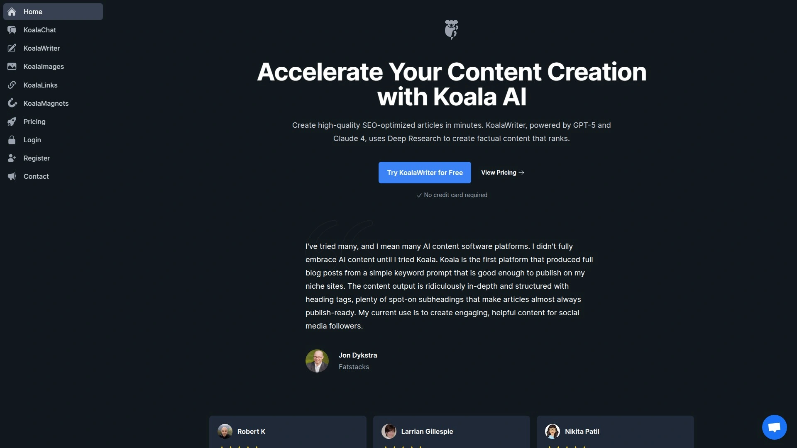
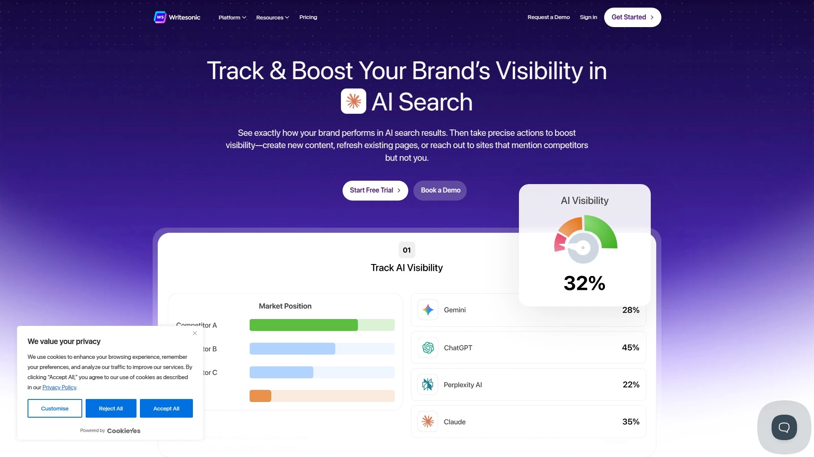
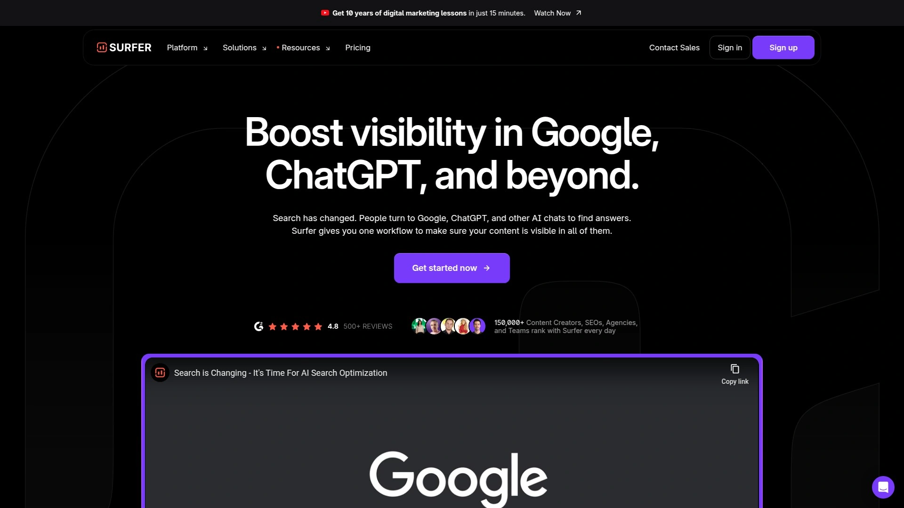
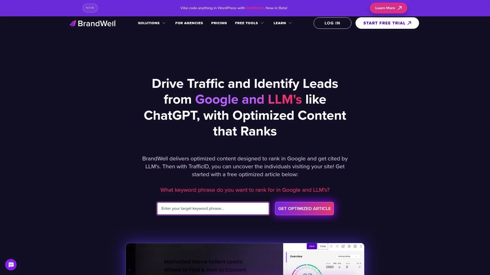
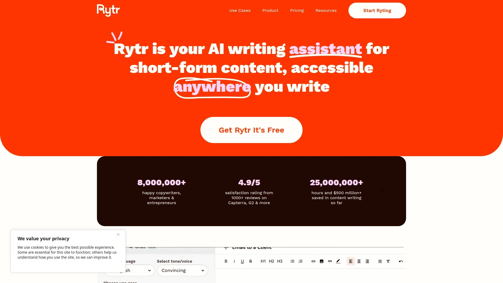

# 2025's Top 11 Best AI-Powered Content Writing Platforms

Writing quality content that ranks takes hours you don't have. Between researching keywords, analyzing competitors, structuring outlines, writing drafts, and optimizing for search engines, a single blog post can eat an entire workday. AI content writing tools compress that timeline from hours to minutes while maintaining the SEO optimization and readability that search engines demand.

---

## **[Koala AI](https://koala.sh)**

Complete SEO content engine with real-time SERP analysis built in.

Koala AI combines KoalaWriter for long-form SEO content and KoalaChat as your research assistant, creating a full ecosystem for content creation. The platform analyzes top-ranking pages for your target keyword before writing begins, automatically incorporating crucial entities and semantic keywords that give your articles structural advantages from the start.

Real-time SERP analysis sets Koala apart from tools relying on static training data. Your content gets tailored to current search intent rather than what was relevant months ago. The outline editor provides critical strategic control—the AI suggests structure, but you can easily add, delete, and reorder H2s and H3s before generation, letting you inject expertise and guide the narrative.

Specialized article types include standard blog posts, Amazon product roundups powered by live data, engaging listicles, and local places roundups for local SEO. The platform handles both short-form marketing copy and long-form blog posts with over 1,500 words, generating structured drafts in 30 seconds. Multiple draft variations for single inputs give you options to choose from and refine.

Built-in SEO features provide keyword suggestions and integration tips that align content with ranking practices. The image generator creates custom visuals, and internal linking tools help structure site architecture for better crawlability. Speed and efficiency excel for users with tight deadlines, while the minimalist interface keeps focus on writing without unnecessary distractions.

Deep Research mode with real-time data and source controls represents a significant differentiator in AI writing tools. The platform reports average 2x boosts in conversions for users implementing its content strategies.

**Best for SEO-focused content creators, bloggers scaling output, agencies managing multiple clients, and businesses serious about organic traffic growth through optimized long-form articles.**

***

## **[Jasper AI](https://www.jasper.ai)**

Enterprise-grade AI writer with team collaboration and brand voice matching.

Jasper AI serves over 100,000 users worldwide including major brands like AirBnB, Intel, and Zoom. The platform excels at generating high-quality long-form content with advanced SEO optimization templates and campaign copy capabilities. Boss Mode unlocks long-form content creation with proper grammar, SEO optimization, and natural flow that reads authentically human.

Team collaboration features include shared workspaces, approval workflows, and centralized brand guidelines that ensure consistency across all content. The platform supports custom use cases beyond standard templates, giving flexibility to create specialized content types unique to your business needs.

Content quality consistently ranks high in user reviews, with particular strength in maintaining context across longer articles. The AI follows instructions reliably and handles complex project requirements that simpler tools struggle with. Integration with plagiarism checking through Copyscape ensures content originality.

Over 50 templates cover marketing emails, blog posts, product descriptions, social media content, ad copy, and creative writing. The tone-matching feature adapts content to your preferred voice, whether professional, casual, persuasive, or educational. Multi-language support extends content creation to global audiences.

**Ideal for marketing teams scaling content production, enterprises requiring collaboration tools, brands prioritizing content quality over budget constraints, and agencies managing diverse client portfolios.**

***

## **[ChatGPT](https://chat.openai.com)**

Versatile conversational AI that handles everything from brainstorming to full drafts.

ChatGPT revolutionized AI writing by making powerful language models accessible to everyone. The free version provides incredible value for solo creators and small businesses testing AI content creation. The simplicity and user-friendly interface remove barriers that make other platforms feel overwhelming.

Content generation spans keyword-rich articles, meta descriptions, structured outlines, product descriptions, email campaigns, and social media posts. The conversational interface lets you refine outputs through follow-up prompts, iteratively improving results until they match your vision. This back-and-forth process mimics working with a human assistant.

The platform excels at brainstorming, outlining, and breaking through writer's block. Ask ChatGPT to generate 10 headline ideas, outline a blog post structure, or suggest angles for covering a topic, and you'll get diverse options within seconds. Tone shifts handle everything from technical documentation to playful social content.

ChatGPT Plus ($20/month) unlocks GPT-4 access with improved reasoning, reduced hallucinations, and better context retention across longer conversations. Custom instructions let you define preferred writing styles, target audiences, and content requirements that persist across all interactions. Integration possibilities through APIs enable automation of repetitive content tasks.

**Perfect for solopreneurs and freelancers working within tight budgets, brainstorming assistance, quick content drafts, and anyone wanting powerful AI writing without learning complex software.**

***

## **[Writesonic](https://writesonic.com)**

Speed-focused AI writer with 80+ templates and affordable pricing.

Writesonic generates articles up to 1,500 words in 30 seconds, making it one of the fastest content creation platforms available. The platform offers over 80 pre-built templates covering blog posts, product descriptions, ad copy, website content, social media posts, and specialized formats like TikTok scripts.

Chatsonic provides a conversational chatbot with GPT-4 capabilities similar to ChatGPT but with additional features like image generation through Photosonic. This creates unique visuals based on prompts, eliminating reliance on stock photography. The workflow simplifies to select template, input details, and receive content—straightforward enough for anyone to master quickly.

SEO automation includes keyword suggestions, platform integrations, and optimization scoring that guides improvements. Semrush integration provides keyword research capabilities directly within the editor, helping identify ranking opportunities without switching tools. Content quality balances speed and accuracy, delivering contextual copy that sounds natural.

Multilingual support creates content in 24 languages, valuable for international businesses or creators targeting non-English audiences. The platform positions itself as the affordable Jasper alternative, offering comparable features at significantly lower price points. Starting plans begin free with paid options from $12.67/month.

**Best for budget-conscious creators, marketers needing high content volume quickly, businesses wanting templates for diverse content types, and international teams requiring multilingual support.**

***

## **[Copy.AI](https://www.copy.ai)**

Go-to-market team platform specializing in sales and marketing workflows.

Copy.AI focuses heavily on go-to-market teams spanning sales, marketing, and operations rather than just content creation. The platform excels at short-form content with templates specifically designed for sales outreach, ad copy, product descriptions, and social media captions. This GTM specialization makes it particularly valuable for teams scaling prospecting and conversion content.

Workflow automation connects content creation to sales and marketing processes through integrations with CRMs, email platforms, and marketing automation tools. Generate personalized sales emails at scale, create ad variations for A/B testing, or produce product descriptions for entire catalogs in bulk. Keyword consistency tools ensure messaging alignment across channels.

The unlimited words plan at $49/month provides exceptional value for teams producing high content volumes. Compare this to competitors charging per word or imposing strict monthly limits. Template variety covers over 90 use cases, though the focus remains on short-form content rather than long articles.

Multilingual support and ease of use make Copy.AI accessible to non-technical team members. The friendly interface receives praise for simplicity compared to more complex platforms, reducing onboarding time significantly. Seven-day free trial lets you test functionality before committing.

**Ideal for sales teams scaling outreach, marketing teams creating ad campaigns, e-commerce businesses generating product copy, and GTM operations focused on conversion-oriented content.**

***

## **[Surfer SEO](https://surferseo.com)**

Data-backed content optimization with NLP and correlation analysis.

Surfer SEO takes a scientific approach to content optimization, analyzing top-ranking pages through natural language processing to identify patterns that correlate with rankings. The platform's Content Score correlates 26% with Google rankings—significantly higher than competitors like Frase at barely 0.1% correlation.

NLP algorithms parse top-ranking content to identify semantically related keywords, extract key entities (people, places, concepts), and understand topical landscapes of search queries. This deeper analysis goes beyond simple keyword density to structural and semantic factors that influence rankings. Coverage Booster identifies keyword and content gaps in your article, filling them with new content to improve ranking potential.

Auto Optimize provides one-click AI-powered improvements to content scores. The system reviews articles piece by piece and suggests immediate enhancements you can apply instantly while maintaining your original tone and structure. This optimization workflow extends beyond drafting to create truly competitive, complete content.

The platform continuously monitors how AI systems surface content and adapts recommendations to align with LLM optimization. This forward-compatible approach prepares content for AI-generated answer engines like Google's AI Overviews, Perplexity, and ChatGPT. Real-time scoring shows SEO performance as you write, with specific recommendations for improvement.

**Perfect for SEO professionals prioritizing data-backed optimization, content teams focused on competitive rankings, agencies requiring proven results, and businesses investing in long-term organic visibility.**

***

## **[Frase](https://www.frase.io)**

Research-driven content brief creator with dual SEO and GEO optimization.

Frase transforms search results into writing-friendly spaces with helpful insights, suggested headings, and AI assistance for rapid draft production. The platform analyzes top 20 Google results to understand what's ranking, identifying topics, questions, and content patterns from competitors so you know exactly what to cover.

Dual scoring provides separate SEO scores for Google and GEO (Generative Engine Optimization) scores for AI platforms like ChatGPT, Perplexity, Claude, and Gemini. This positions content for both traditional search engines and AI answer engines that increasingly influence user queries. Questions extracted from search data boost chances of getting cited by AI platforms that prioritize direct answers.

AI-generated outlines ensure comprehensive topic coverage based on SERP analysis, including headings, subheadings, and suggested content structure. Real-time recommendations provide specific suggestions to improve both SEO and GEO as you write, with optimization updates showing how changes affect scoring. The content editor makes producing drafts quick and clean, though it doesn't guide optimization past the first draft like Surfer.

Pricing starts at $38.25/month for SEO plus GEO optimization, significantly cheaper than Surfer's $89/month for SEO-only optimization. This makes Frase accessible for smaller teams and solo creators who need sophisticated optimization without enterprise budgets.

**Best for content teams focused on research-driven briefs, creators optimizing for both Google and AI search, solo creators on limited budgets, and writers needing comprehensive SERP analysis.**

***

## **[BrandWell AI](https://brandwell.ai)**

Long-form SEO content specialist with built-in optimization scoring.

BrandWell AI (formerly Content at Scale) specializes in producing long-form, SEO-optimized content with advanced research capabilities. Multiple AI engines analyze keywords and topics to generate engaging educational text using proprietary machine learning models aimed at improving search engine rankings. The platform creates high-quality content within minutes, letting writers focus on strategy and promotion rather than drafting.

Built-in SEO tools include optimization scoring that updates in real-time as you edit content. Watch the score increase or decrease based on changes, providing immediate feedback on whether edits improve SEO performance. Content gap analysis shows what competitors include that you don't, with NLP-driven suggestions to fill these gaps naturally.

The editor excels for blog posts and long-form content by combining AI writing with robust SEO features. ASK AI writing features appear in the editor as you type, offering contextual assistance that makes content creation easier. Coverage verification ensures depth and completeness, particularly important for YMYL (Your Money Your Life) content requiring authority.

Versatility extends beyond blog posts to meta descriptions, YouTube descriptions, guest articles, social media captions, multilingual content, and product descriptions. The platform emphasizes producing content that ranks rather than simply generating words, differentiating it from general-purpose AI writers.

**Ideal for content marketers with extensive publishing needs, businesses focused on organic traffic growth, agencies scaling client content, and brands prioritizing SEO-engineered articles over quick drafts.**

***

## **[Rytr](https://rytr.me)**

Affordable all-round text generator with 40+ use cases and free plan.

Rytr serves over 6.5 million users with straightforward text generation across 40+ templates covering blogs, emails, product descriptions, ads, and web copy. The platform focuses on accessibility with a genuinely useful free plan providing 10,000 characters monthly—perfect for testing AI writing without financial commitment.

Beyond standard content generation, Rytr offers editing tools including content expansion, improvement, and rewriting functions. SEO-focused features include keyword extractors and generators that identify ranking opportunities. Idea-generation tools create brand names, business concepts, video ideas for YouTube channels, story plots, and song lyrics.

Customizable templates let you build use cases specific to your needs when pre-built options don't fit. This flexibility adapts Rytr to specialized content requirements without forcing workarounds. Support for 30+ languages enables global content creation. Plagiarism checking ensures content originality across all generated text.

The interface emphasizes simplicity without sacrificing capability. Choose from 20+ tones to give content the right feel, from professional and authoritative to friendly and conversational. Image generation complements written content with visual assets. Paid plans start at just $9/month for 100,000 characters, making it one of the most affordable AI writers available.

**Perfect for entrepreneurs and small businesses starting with AI content, creators needing flexible use cases, multilingual content production, and anyone wanting affordable access to quality AI writing.**

***

## **[Clearscope](https://www.clearscope.io)**

Content discoverability platform optimizing for Google and AI search engines.

Clearscope positions itself as a discoverability platform for the new era in search, improving and monitoring content visibility in Google, ChatGPT, and emerging AI answer engines. The Draft with AI feature streamlines the toughest parts of blog writing—getting started and scaling production—through an integrated workflow that moves from search query to first draft faster.

Real-time guidance through the content creation process includes clarifying searcher intent, selecting appropriate content types (research articles, how-to guides, explainers, product descriptions), and customizing tone to match brand voice. The platform infers tone from existing monitored pages or accepts writing samples to learn your style, ensuring drafts sound authentic rather than templated.

SEO and readability optimization happens simultaneously as you write, with safeguards against plagiarism and low-quality generic outputs. The system generates content following best practices by default while remaining flexible enough to accommodate different industries, formats, and platforms. Use cases span first drafts for long-form posts, repurposing old content with new search intent, automating SEO-based outlines, and overcoming writer's block.

AI Citations tracking shows which pages AI engines cite most, helping you understand and optimize for this growing visibility channel. The platform emphasizes people-first content that uses AI to assist and streamline rather than completely automate strategy.

**Best for content strategists managing multiple sites, agencies supporting diverse client verticals, solo bloggers scaling calendars, and teams focused on discoverability across both traditional and AI search.**

***

## **[StoryChief](https://storychief.io)**

All-in-one content operations platform with AI writing and multi-channel publishing.

StoryChief combines AI writing with full-scale content collaboration, SEO auditing, and multi-channel publishing in a unified platform. This comprehensive approach addresses the entire content lifecycle from ideation through distribution rather than just the writing phase. Brand voice detection automatically learns and applies your tone and style across all content.

The AI content calendar generator creates strategic publishing schedules with 20+ AI-powered prompts for maintaining consistent output. Content gap and SEO auditing spot weak pages or keyword opportunities with AI-guided fixes, helping optimize existing content alongside new creation. Weekly audits check content performance and suggest updates to keep published articles relevant.

One-click publishing distributes content to your CMS, social media channels, and newsletters simultaneously. This eliminates the tedious process of manually formatting and posting to each platform separately. Campaign creation and research features help plan initiatives, analyze competitors, and gather trending ideas through always-available AI assistance.

Everyday marketing tasks like cover image creation, SEO briefs, translations, and tone adjustments happen on demand within the platform. Integration capabilities extend to various marketing tools and platforms, creating a centralized hub for content operations. The platform emphasizes making content teams' lives easier through collaboration features and workflow automation.

**Ideal for content marketing teams managing multi-channel strategies, agencies coordinating client content calendars, businesses wanting integrated creation and distribution, and teams prioritizing collaboration workflows.**

***

## **[HubSpot AI Content Writer](https://www.hubspot.com)**

Integrated content assistant across marketing, sales, and CRM tools.

HubSpot's AI content writer integrates directly into the platform's marketing, sales, and content features, letting teams create and edit copy in tools they already use daily. This native integration eliminates context switching between separate AI writing tools and your operational systems. Simply input a prompt or topic and generate prospecting emails, landing pages, or blog posts without leaving HubSpot.

Content versatility spans blog posts, emails, social media captions, product descriptions, and landing page copy. The AI assistant appears across multiple HubSpot modules, providing contextual writing support wherever you're working. This ubiquitous availability makes content creation a seamless part of existing workflows rather than a separate task requiring dedicated tools.

Businesses scale content creation without additional resources or headcount. The AI generates initial drafts quickly, reducing time from ideation to publication significantly. Repurposing and refining content for different channels happens within the same interface, maintaining efficiency across the content distribution process.

Free access to AI content writer features provides value without additional investment for existing HubSpot users. Advanced editing tools refine AI-generated drafts into polished, brand-centric content ready for publication. Comprehensive integration with HubSpot's expansive marketing and sales ecosystem ensures unified content strategy aligned with CRM data and customer insights.

**Perfect for businesses already using HubSpot's platform, marketing teams wanting integrated content creation, sales teams generating prospecting emails, and organizations prioritizing unified marketing technology stacks.**

***

## FAQ

**Can AI writing tools actually produce content that ranks on Google?**

Yes, when used properly. Tools like Koala AI, Surfer SEO, and Frase analyze top-ranking pages and incorporate semantic keywords, entities, and structure that search engines favor. However, AI-generated content requires human editing to add expertise, authenticity, and nuance that algorithms can't replicate. The best approach treats AI as a research and drafting assistant that handles time-consuming tasks, letting you focus on strategic thinking and refinement that differentiates your content from competitors.

**Which AI content writing tool offers the best value for small businesses?**

Rytr provides exceptional value with a free plan offering 10,000 characters monthly and paid plans starting at just $9/month. ChatGPT's free version delivers powerful capabilities without any cost. For SEO-specific needs, Frase offers comprehensive optimization at $38.25/month—significantly cheaper than alternatives. The best choice depends on whether you prioritize general writing assistance, SEO optimization, or specific content types like sales copy or social media posts.

**How do I prevent AI-generated content from sounding generic?**

Inject personal experience, specific examples, and unique perspectives during editing. Use AI for structure and first drafts, then add stories, case studies, and insights only you can provide. Customize tone settings to match your brand voice and specify target audiences clearly in prompts. Tools with brand voice training like StoryChief and Jasper learn your style over time, producing increasingly authentic results. Always edit AI outputs to remove repetitive phrasing and add conversational elements that create connection with readers.

---

## Conclusion

The AI content writing platforms above each specialize in different aspects of the content creation workflow, from pure speed to comprehensive SEO optimization to enterprise collaboration. Testing free trials helps identify which features matter most for your specific content needs and production volume. [Koala AI](https://koala.sh) stands out for creators and businesses prioritizing SEO-focused content creation with its real-time SERP analysis, specialized article types for different use cases, and deep research capabilities that produce data-backed content optimized for current search intent. The platform's combination of KoalaWriter for long-form articles and KoalaChat as a research assistant creates a complete ecosystem specifically engineered for organic traffic growth through strategically optimized content.

[2](https://skywork.ai/skypage/en/Koala-AI-In-Depth-Review-(2025):-The-Ultimate-Guide-to-KoalaWriter-and-Beyond/1976135370246123520)
